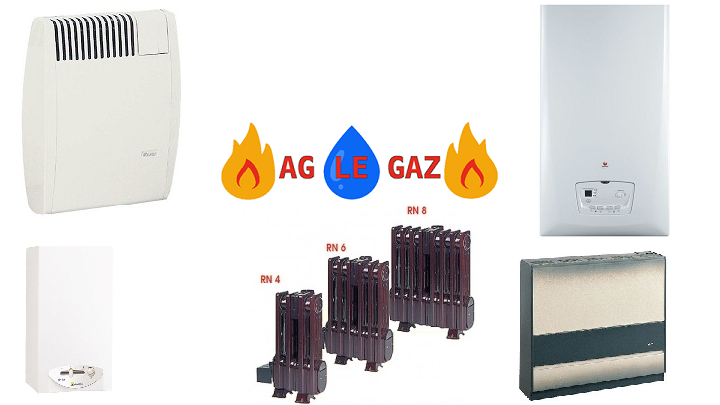

<html lang="fr">
<head>
    <meta charset="UTF-8">
    <meta name="viewport" content="width=device-width, initial-scale=1.0">
    <link rel="stylesheet" href="https://stackpath.bootstrapcdn.com/bootstrap/4.4.1/css/bootstrap.min.css" integrity="sha384-Vkoo8x4CGsO3+Hhxv8T/Q5PaXtkKtu6ug5TOeNV6gBiFeWPGFN9MuhOf23Q9Ifjh" crossorigin="anonymous">
    <link rel="stylesheet" type="text/css" href="css/agLeGaz.css">
    <title>AG LE GAZ</title>
</head>
<body>
    <header>
        <nav class="navbar fixed-top navbar-expand-lg navbar-light" style="background-color: #3f8bfd;"> 
            <a class="navbar-brand mb-0 h1" href="#">AG LE GAZ</a>
            <button class="navbar-toggler" type="button" data-toggle="collapse" data-target="#navbarTogglerDemo02" aria-controls="navbarTogglerDemo02" aria-expanded="false" aria-label="Toggle navigation">
              
            </button>
          
            

              <ul class="navbar-nav mr-auto mt-2 mt-lg-0">
                <li class="nav-item">
                  <a class="nav-link" href="#contact">Contact</a>
                </li>
                <li class="nav-item">
                  <a class="nav-link" href="#mission">Mission</a>
                </li>
                <li class="nav-item">
                  <a class="nav-link" href="#tarifs">Tarifs</a>
                </li>
              </ul>
            

          </nav>
    </header>
    

        <section class="header">
            
        </section>
    

    

        <section class="section">
            <h3 id="contact">Coordonnées de la société</h3>
            <h5>AG LE GAZ</h5>
            
Tél: 06 11 64 33 97

            
Mail: aurelien.aglegaz@gmail.com

        </section>
        <section class="section">
            <h2 id="mission">AG LE GAZ</h2>
            <h5>MISSION DE LA SOCIETE</h5>
            
Fort d'une expérience de 15 ans dans ce domaine, la Société AG LE GAZ effectue l'entretien et le dépannage de vos appareils de production d'eau chaude et chauffage au gaz (Chaudière/Radiateur/Chauffe-eau/Chauffe-bain).

            
L'entreprise est basé sur THIL et effectue ses interventions sur un rayon d'environ 25KM.

        </section>
        <section class="section">
            <h3 id="tarifs">Tarifs professionnels</h3>
            

                <table class="table table-bordered">
                    <thead>
                    <tr>
                        <th scope="col">PRESTATIONS</th>
                        <th scope="col">H.T.</th>
                        <th scope="col">T.T.C.</th>
                    </tr>
                    </thead>
                    <tbody>
                    <tr>
                        <th scope="row">CONTRAT CHAUDIERE</th>
                        <td>140€</td>
                        <td>168€</td>
                    </tr>
                    <tr>
                        <th scope="row">CONTRAT RADIATEUR</th>
                        <td>95.45€</td>
                        <td>114.54€</td>
                    </tr>
                    <tr>
                        <th scope="row">CONTRAT CHAUFFE - EAU/CHAUFFE BAIN</th>
                        <td>95.45€</td>
                        <td>114.54€</td>
                    </tr>
                    <tr>
                        <th scope="row">FORFAIT SANS CONTRAT RADIATEUR/CE/CB</th>
                        <td>90€</td>
                        <td>108€</td>
                    </tr>
                    <tr>
                        <th scope="row">FORFAIT SANS CONTRAT CHAUDIERE</th>
                        <td>113.64€</td>
                        <td>136.37€</td>
                    </tr>
                    <tr>
                        <th scope="row">DEPLACEMENT INFERIEUR OU EGAL A 30km</th>
                        <td>44.55€</td>
                        <td>53.46€</td>
                    </tr>
                    </tbody>
                </table>
            

        </section>
        <section class="section"> 
            <h3>Tarifs particuliers</h3>
            

                <table class="table table-bordered">
                    <thead>
                    <tr>
                        <th scope="col">PRESTATIONS</th>
                        <th scope="col">H.T.</th>
                        <th scope="col">T.T.C.</th>
                    </tr>
                    </thead>
                    <tbody>
                    <tr>
                        <th scope="row">CONTRAT CHAUDIERE</th>
                        <td>140€</td>
                        <td>154€</td>
                    </tr>
                    <tr>
                        <th scope="row">CONTRAT RADIATEUR</th>
                        <td>95.45€</td>
                        <td>105€</td>
                    </tr>
                    <tr>
                        <th scope="row">CONTRAT CHAUFFE - EAU/CHAUFFE BAIN</th>
                        <td>95.45€</td>
                        <td>105€</td>
                    </tr>
                    <tr>
                        <th scope="row">FORFAIT SANS CONTRAT RADIATEUR/CE/CB</th>
                        <td>90€</td>
                        <td>99€</td>
                    </tr>
                    <tr>
                        <th scope="row">FORFAIT SANS CONTRAT CHAUDIERE</th>
                        <td>113.64€</td>
                        <td>125€</td>
                    </tr>
                    <tr>
                        <th scope="row">DEPLACEMENT INFERIEUR OU EGAL A 30km</th>
                        <td>44.55€</td>
                        <td>49€</td>
                    </tr>
                    </tbody>
                </table>
                <button onclick="topFunction()" id="topBtn" title="Go to top"></button>
            

        </section>
    

        <footer>
            
<small><strong>AGLEGAZ : SASU au capital de 4000€ - 913 chemin du mas durand 01120 Thil - 852 568 039 RCS Bourg en Bresse APRM 4322BC</strong></small>

            
<small>Website by Marion KOO SIN LIN</small>

        </footer>
    
     
    
    
    
</body>
</html>
